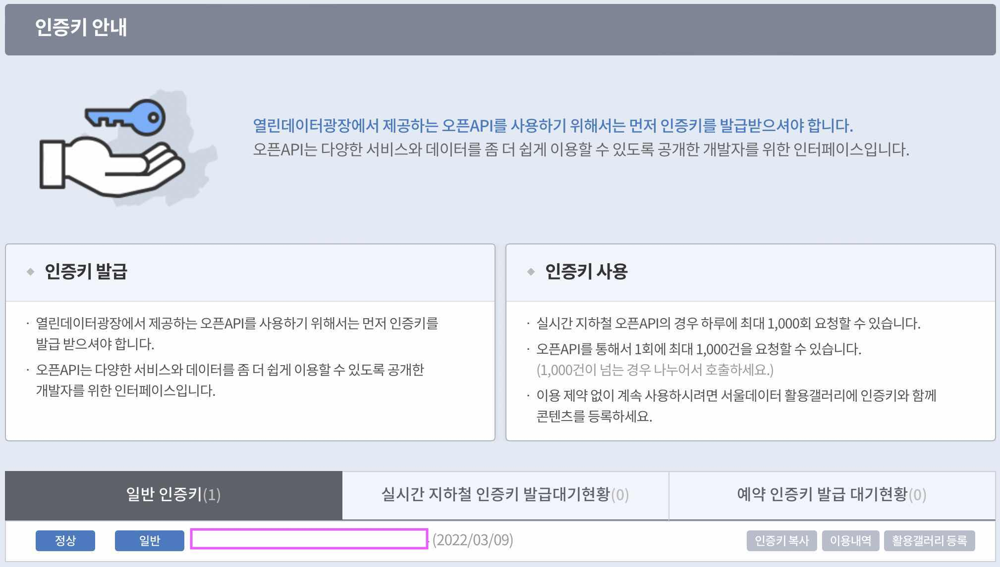

# ConcurrentMovieList
DispatchQueue 성능 비교와 실습을 위한 레포지토리입니다.

## Installation

1. 서울특별시 열린데이터 광장을 들어간다.   
[서울_열린데이터_광장](https://data.seoul.go.kr)
2. API-Key 발급이 필요한데, 회원가입이 되어 있지 않다면 계정을 만들도록 한다.   
이미 계정이 있다면 **[나의화면]-[인증키 신청]** 을 통해 키를 신청하거나,   
키가 있는지 확인하고 싶다면 **[나의화면]-[인증키 관리]** 를 통해 키를 확인한다.   
_(키의 형태는 아주 긴 숫자와 알파벳 조합의 문자열이다.)_   
_(API-Key는 일반 Key로도 충분하다.)_
3. 발급받은 키를 APISessionModel.swift 파일의 ```private let apiKey: String``` 변수에 지정해준다.



API 정보 = [서울시_문화공간-정보](http://data.seoul.go.kr/dataList/OA-15487/S/1/datasetView.do)

### 사용된 동시성 API 정보

1. 미리 지정된 DispatchQueue 사용.
2. DispatchWorkItem + DispatchGroup 조합을 이용한 동시성 모듈화 구현(디버깅).
3. Semaphore 이용하여 데드락, 선점효과 등을 차단.
